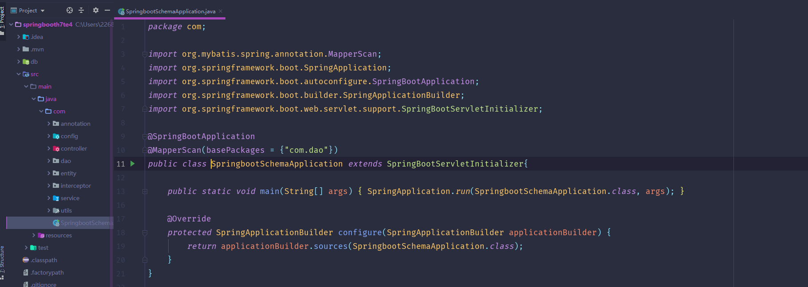
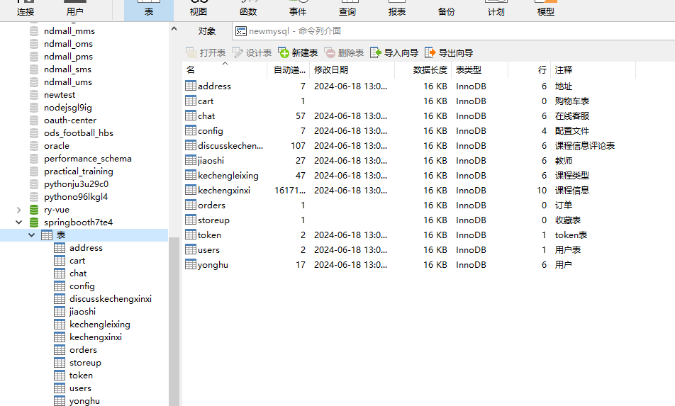
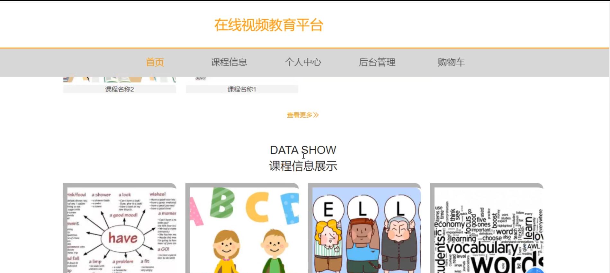
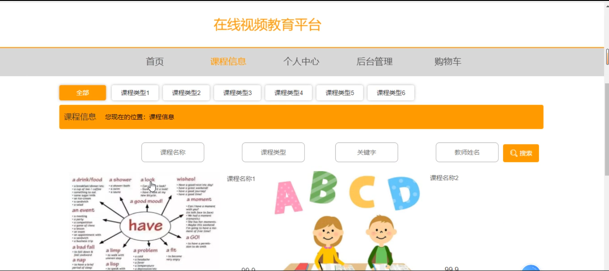
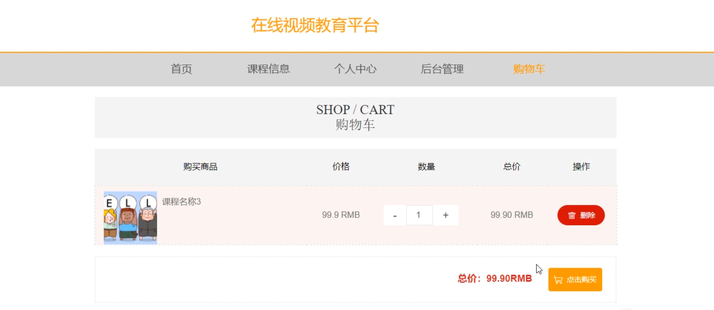
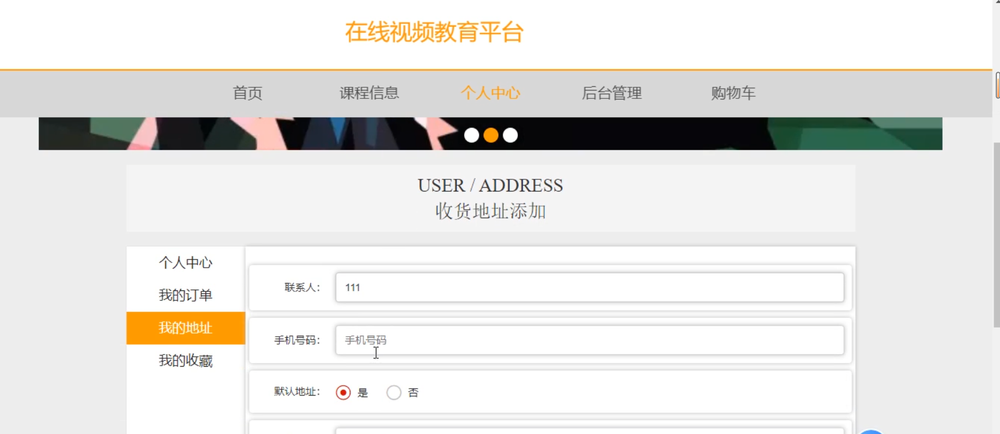
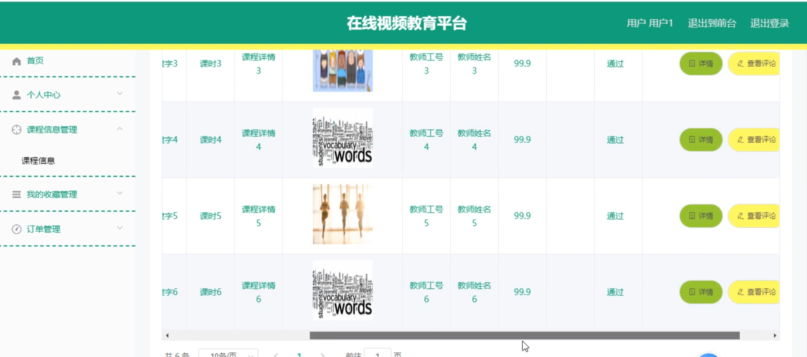
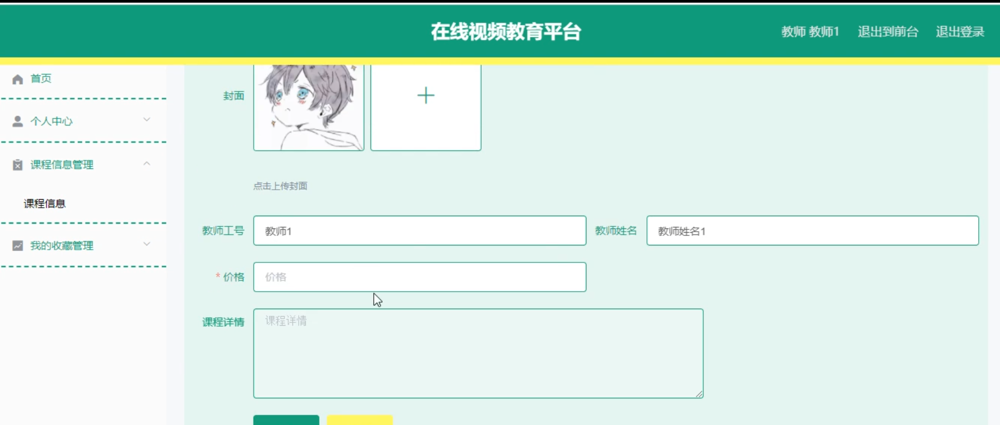
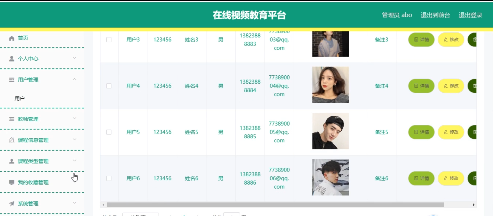

# 基于SpringBoot的在线视频教育平台

---
### 👉作者QQ ：1556708905 微信：zheng0123Long (支持定制修改、部署调试、定制毕设)

### 👉接网站建设、小程序、H5、APP、各种系统等

---

#### 介绍

本系统是一款基于SpringBoot开发的在线视频教育平台，旨在为学生提供便捷、高效的在线学习环境，并为教师和管理员提供全面、易用的管理工具。系统设计分为管理端、教师端和学生端三个角色，各角色拥有不同的功能模块，全面满足各类用户的需求。通过该平台，用户可以实现在线课程学习、课程管理、用户管理和系统管理等多项功能，提升教育资源的利用效率和教学质量。

#### 技术栈介绍

后端技术栈：Springboot+Mysql+Maven

前端技术栈：Vue+Html+Css+Javascript+ElementUI

开发工具：Idea+Vscode+Navicate

#### 系统功能介绍

管理端功能模块

个人中心：管理员可以查看和修改个人信息，管理账户安全和偏好设置。

用户管理：管理员可以管理系统内所有用户的基本信息，确保用户数据的完整性和有效性。

教师管理：管理员可以管理平台内的教师信息，包括新增、删除和编辑教师信息。

课程信息管理：管理员可以新增、删除和编辑平台内的课程信息，维护课程数据库。

课程类型管理：管理员可以管理课程的分类，便于课程的分类管理和查询。

我的收藏管理：管理员可以查看和管理平台内用户的收藏信息，提供收藏管理功能。

系统管理：管理员可以进行系统设置和维护，确保系统的正常运行和安全性。

订单管理：管理员可以查看和管理平台内用户的订单信息，维护订单数据库。

教师端功能模块

个人中心：教师可以查看和修改个人信息，管理账户安全和偏好设置。

课程信息管理：教师可以新增、删除和编辑自己教授的课程信息，维护课程数据库。

我的收藏管理：教师可以查看和管理自己的收藏信息，提供收藏管理功能。

学生端功能模块

个人中心：学生可以查看和修改个人信息，管理账户安全和偏好设置。

课程信息：学生可以查看平台内所有可选课程的信息，选择适合自己的课程进行学习。

后台管理：

课程信息管理：学生可以查看和管理自己已选的课程信息，包括课程进度、作业和成绩等。

我的收藏管理：学生可以查看和管理自己收藏的课程和资料，方便后续学习和复习。

订单管理：学生可以查看和管理自己的订单信息，确保订单信息的准确性和完整性。

购物车：学生可以将感兴趣的课程加入购物车，方便统一结算和选购。

#### 系统作用

对管理端的作用

高效的用户和教师管理：通过系统化的管理，管理员可以轻松维护用户和教师信息，提升管理效率。

全面的课程管理：系统提供完善的课程信息和类型管理功能，确保课程信息的准确性和及时更新。

便捷的订单管理：管理员可以集中管理用户订单信息，确保订单的处理及时和准确。

对教师端的作用

便捷的课程管理：教师可以轻松管理自己教授的课程信息，确保课程内容的更新和维护。

收藏功能：教师可以管理和查看自己的收藏，方便教学资料的整理和使用。

对学生端的作用

个性化的课程选择：学生可以根据自己的需求选择适合的课程进行学习，提升学习的自主性和灵活性。

全面的学习管理：学生可以通过后台管理功能，查看和管理自己的课程进度、作业和成绩，提升学习效率。

便捷的购物车功能：学生可以将感兴趣的课程加入购物车，方便统一结算和选购，提升用户体验。

#### 系统功能截图

代码结构

数据库表

首页

课程信息

登录

购物车

个人中心

后台管理

教师端

管理端

#### 总结

基于SpringBoot的在线视频教育平台通过信息化手段，实现了管理端、教师端和学生端的全面功能覆盖，满足了各类用户的需求。系统的高效、便捷、安全的特点，不仅提升了教育管理的效率和服务质量，还通过规范化的管理流程，确保了信息的准确性和透明度。未来，本系统将继续优化和扩展功能，为用户提供更优质的在线教育服务和体验。

#### 使用说明

创建数据库，执行数据库脚本 修改jdbc数据库连接参数 下载安装maven依赖jar 启动idea中的springboot项目

后台地址：http://localhost:8080/springbooth7te4/admin/dist/index.html

管理员  abo 密码 abo

前台地址：http://localhost:8080/springbooth7te4/front/index.html

